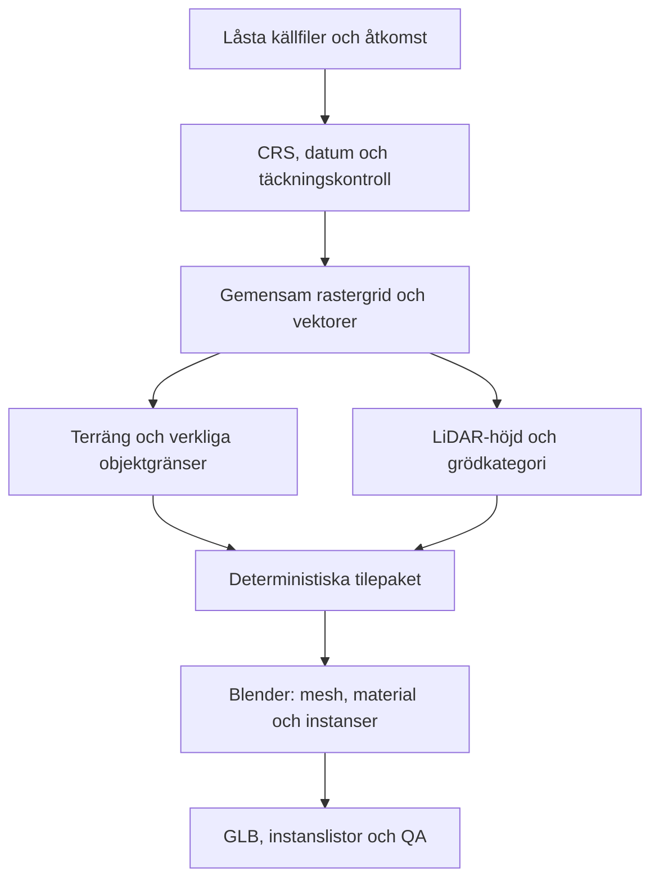

# Geodata → Blender

## Koordinater och bevis

All horisontell arbetsgeometri är **SWEREF99 TM, EPSG:3006**, med `always_xy=True`: öst, nord. Godkänd mark-/objekthöjd ska vara **RH2000, EPSG:5613**. LM:s compound-CRS EPSG:5845 innehåller båda. Kommunala källor kan vara EPSG:3008 och måste reprojiceras uttryckligt.

En horisontell transform ändrar aldrig Z. SRTM/EGM96 är en särskild preview med EPSG:5773. Den får inte döpas om till RH2000. En riktig datumkonvertering kräver relevant vertikal transformation/geoidmodell och kontrollpunkter; sådan konvertering implementeras inte genom att addera en gissad konstant.

Blender får tilelokala meter: X öst, Y nord, Z upp. Referensorigin ligger i pilotens sydvästra hörn. glTF-exporten konverterar till X öst, Y upp, Z syd. Runtime-translationen blir `(E−E0, H, −(N−N0))`; koordinater omkring sex miljoner meter matas inte direkt till GPU:n.

Varje insatsfil har källa, år/datum där känt, filhash, licensbevis, användningsstatus och `measured`, `derived` eller `modeled`. Footprint, höjd och tak kan ha olika evidens. OSM-höjd är inte automatiskt en mätning. Alla dessa uppgifter stannar i produktionsdata och granskningsverktyg.

## Genomförd implementation

- **Hämtning:** räknade WFS-svar, paginering, ArcGIS-ID-batcher, STAC-paginering, checksummor och tydliga budgetar. Begränsad OSM-komplettering hämtar hela relevanta relationer; ofullständiga polygoner avvisas. Endast läsoperationer mot kommunens tjänster.
- **Normalisering:** maskerade GeoTIFF samt legacy-ZIP; en enda gemensam vertexgrid inklusive halo. Rasterpixelcentrum läggs på meshvertex, vilket undviker ett halvcellsfel. Närmaste granne för klasser, bilinjärt för kontinuerliga höjder. Nodata blir hål eller stopp, inte nollhöjd.
- **Terräng:** delade kantvärden mellan lika LOD, normaler uppåt, metrisk skala, begränsat antal trianglar. Riktig DTM används när den tillförs. 2 m mesh från 30 m data ger inte 2 m noggrannhet.
- **Byggnader:** fulla verkliga footprints, innergårdar och konkaviteter, en tileägare. LiDAR ger normaliserad höjd och en försiktig enkelplansanpassning med stödkrav. Sadeltak kräver flerplanssegmentering; en olöst takkonstruktion är modellerad.
- **Vägar:** verklig linje/yta draperas och delas på terrängen. Angiven bredd används; saknad bredd modelleras bara i preview. Broar/tunnlar hoppas över med rapporterat gap. Körfält, trottoar, räcke och spårgeometri är nästa steg när officiella attribut finns.
- **Vatten:** slutna polygoner krävs. Tillförda nivåer måste matcha terrängens höjddatum. Preview får NMD:s grova vattenmask och en uttryckligt modellerad nivå. Ingen global havsrektangel över hela scenen.
- **Vegetation:** verklig skiftespolygon och årsbestämd grödkod styr kategori. NMD styr skogsutbredning. LiDAR-kronhöjd kan kopplas till modellerade trädlägen. Stöd saknas ännu för tillförlitlig artfördelning och beståndstäthet. Hashfrö per global scattercell gör tileordningen oberoende.
- **Blender:** Python bygger collection, terräng-UV, PBR-grundmaterial, prototype-assets och Geometry Nodes med `Instance on Points`. Instanser realiseras inte. GIS-paket körs utanför Blender.
- **Utdata:** `.tile.json.gz`, PNG-grundmaterial och `manifest.json`; Blender skapar `.blend`, GLB för vald terräng-LOD, `*-instances.json` och `prototype-assets.glb`.

En tile importerar två andra terräng-LOD först när den valts vid nästa körning; alla tre ligger i mellanformatet. GLB-instanslistorna är fortfarande ENU och måste omvandlas till glTF-axlar av runtime-adaptern. Generiska shadernoder/vattenbrus följer inte automatiskt med till glTF; PBR-basvärden och texturer gör det. Materialbakning återstår.

## Kontrakt för indata

`data/<jobb>/catalog.json` använder `schema: 1`, `assets: {roll: [poster]}` och valfri verifierad `crop_map`. Filvägar är relativa till katalogen. Varje post innehåller `path`, `sha256`, `source`, `license`, `license_evidence`, `use_status`, `evidence`, `horizontal_crs`; terräng/LiDAR även `vertical_crs`. Terräng anger `native_resolution_m` och `surface_kind`.

GeoJSON ska ha deklarerat CRS i katalogen (och matchande CRS i filen om det finns). Fältpolygoner kräver `arslager` och `grdkod_mar`. Byggnader kan ha `height_m`; vägar `width_m`, `surface`, `bridge`, `tunnel`; vatten `water_level_m`, `vertical_crs`. En källa per roll tillåts tills fusion/deduplicering uttryckligen gjorts. Filer med oklar användningsrätt avvisas även i preview.

Kommunala multipatches kan hämtas och arkiveras med `stripMaterials`, men **3D-topologi importeras ännu inte**. 2D-importören avvisar dem så att verkliga tak inte råkar plattas ut. Ortofoto kan registreras men **UV-projicering/materialbakning från ortofoto är ännu inte implementerad**; en post i katalogen gör inte materialet färdigt.

## Runtime och skalning

**500 m är ett första arbetsval, inte en fast runtime-arkitektur.** Det ger fyra oberoende tiles i piloten och ungefär 125 000 terrängtrianglar per tile vid 2 m grid. Testa 250/500/1000 m med `goosen benchmark`. Den genomförda mätningen gäller Python-förbehandling; den motiverar inte något FPS-löfte.

Efter godkänd värld jämförs en liten glTF/Three.js-läsare (WebGL2 och WebGPU) med 3D Tiles för hierarkisk streaming. Mät P50/P95-frametid, minnesbelastning, kallstart, synliga trianglar/instanser och tilebyte på en dokumenterad måltelefon och en dator. 60 FPS på dator och 30 FPS på telefon är kandidatmål, inte verifierade resultat.

Runtime måste hantera floating origin, culling, instansbatcher, närområdets växtkluster, förenklade mellandistansassets och långt material/impostors. Terrängens blandade LOD behöver skirts eller stitching: bara samma LOD:s kantvärden är verifierade nu. Separera rådata, byggcache och publicerbara tiles i objektlagring; håll checksummemanifest i Git. Återstående kvoter/licenser bestäms innan kommunomfattande nedladdning.

Flygkontroll kommer efter världsgranskningen: mjuk roll/pitch, begränsad acceleration, vindfält, separerad vingslagsanimation och dämpad kamera vid gåsens rygg. En egen gåsgestalt skapas; ingen bokillustration eller specifik skyddad Nils-gestalt återanvänds.
